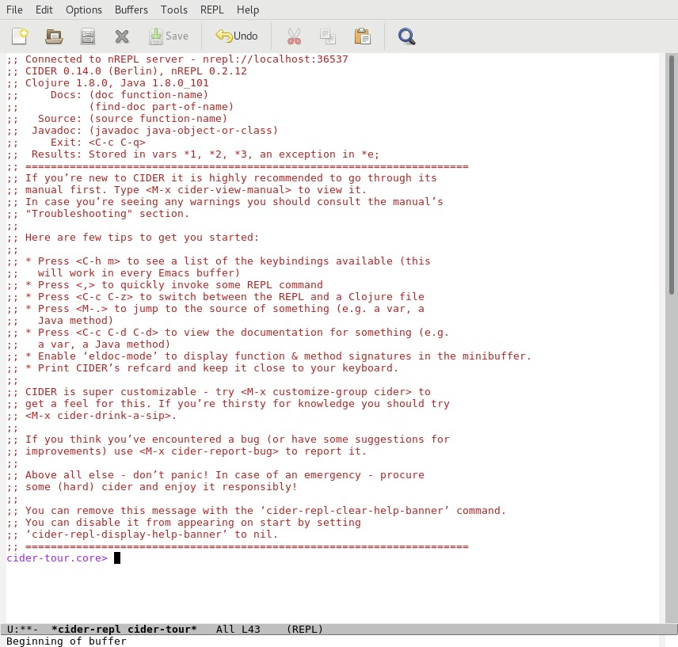

# Starting CIDER

Let's start a REPL session on the cider-tour project.

In Emacs open the `core.clj` file in the  `src/cider-tour` directory:

and do one of the following:

1. Select 'Start a REPL' from the 'CIDER' menu
2. Type `M-x cider-jack-in`
3. Type `C-c M-j`

In response, CIDER performs the following actions:

* Invokes Leiningen to start a new REPL background process
* Evaluates the `core.clj` file in the REPL.
* Sets the current namespace of the REPL to the namespace of the `core.clj` file (as indicated by the cider-tour.core&gt; prompt).
* Opens a buffer window for user interaction with the REPL.

CIDER displays a banner message in the REPL buffer that provides helpful information for new users:

