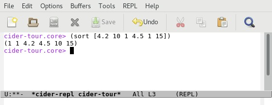
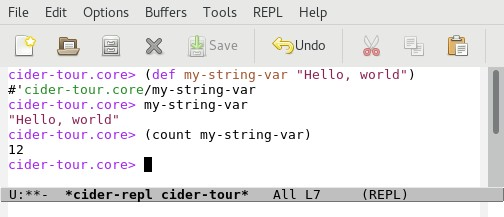
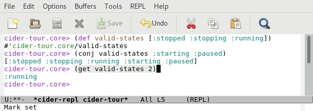

# Evaluating Code in the REPL

Now that we have a REPL session, let's evaluate some Clojure code.

## Clojure Expressions

#### 1.4 times 67 
Enter`(* 1.4 67)`

#### Print "Hello, world!"
Enter `(println "Hello, world!")`

#### Sort a Vector (Array) of Numbers
Enter `(sort [4.2 10 1 4.5 1 15])`

#### Sum a Vector of Numbers
Enter `(reduce + [4.2 10 1 4.5 1 15])`

### Increment a Vector of Numbers
Enter `(map inc [4.2 10 1 4.5 1 15])`

## Variables

### Using Variables (a.k.a. "var")

Define a "var" with string content:

`(def my-string-var "Hello, world")`

Display the value of the var:

`my-string-var`

Display the length of the string

`(count my-string-var)`

**Output**

## Collections

### Vectors

Define a var that contains a [vector](https://clojure.org/reference/data_structures#Vectors) of [keywords](https://clojure.org/reference/data_structures#Keywords) representing states:

`(def valid-states [:stopped :stopping :running])`

Add elements to the vector:

`(conj valid-states :starting :paused)`

Return the third element of the vector:

`(get valid-states 2)`

**Output**

### Maps

Define a var that contains a [map](https://clojure.org/reference/data_structures#Maps) which maps states to strings suitable for display in a UI: 

`(def state-display-vals {:stopped "Stopped" :stopping "Stopping" :running "Running"})`

Get the display value for the _:stopped_ state:

`(:stopped state-display-vals)`

Added a mapping for the _:starting_ state:

`(assoc state-display-vals :starting "Starting")`

### Sets

Define a var that contains a [set](https://clojure.org/reference/data_structures#Sets):

### Lists

Define a var that contains a [list](https://clojure.org/reference/data_structures#Lists):

