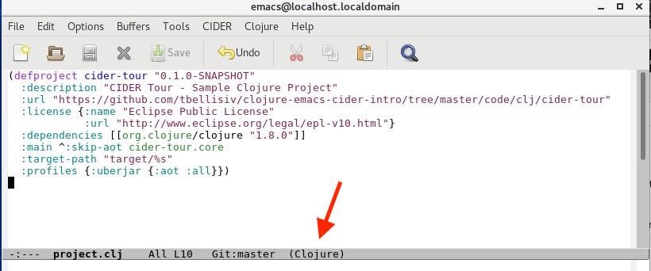

# Clojure Mode

Note that the mode line for the project.clj buffer in the screenshot below displays `(Clojure)` indicating that  `clojure-mode` major mode is enabled. When a file with an extension of `.clj` is opened, Emacs sets the major mode of the buffer to clojure-mode.

**project.clj**
 

`clojure-mode` provides the core Clojure language support for CIDER. This includes:

* Syntax Highlighting (a.k.a. "font locking" in Emacs-speak)
* Indentation
* Refactoring
* REPL Integration

> **FYI**

> CIDER appends entries to the Emacs `auto-mode-alist` variable to enable `clojure-mode` for supported Clojure file types. The main Clojure file extensions are:

>| Extension | Content |
| --- | --- |
| .clj | Clojure Code |
| .cljs | ClojureScript Code |
| .edn | [EDN](https://github.com/edn-format/edn) data (similar in concept to JSON)|

