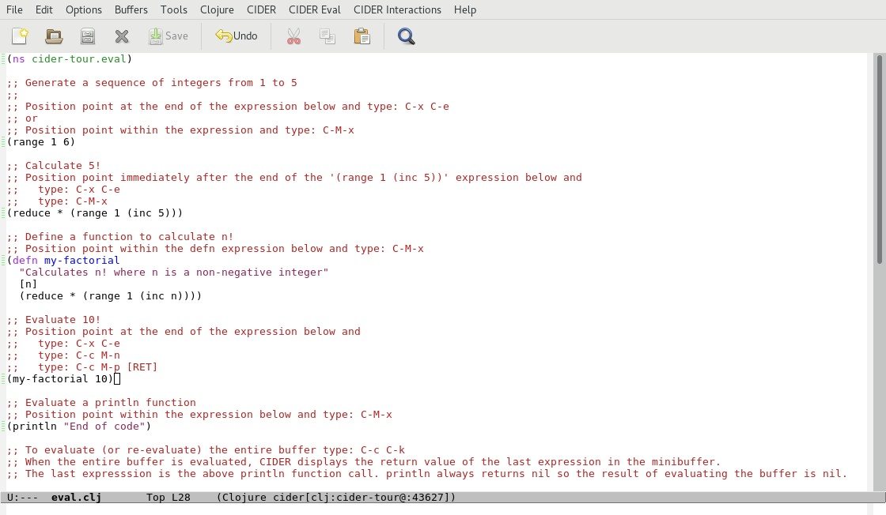

# Code Evaluation

In this section we will explore CIDER's support for evaluation of Clojure code. Open the file `eval.clj` located in the `code/clj/cider-tour/src/cider-tour` directory of the GitHub project:

**Screenshot - eval.clj**

