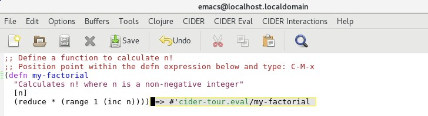
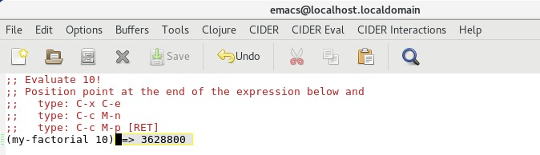
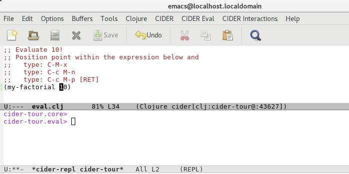
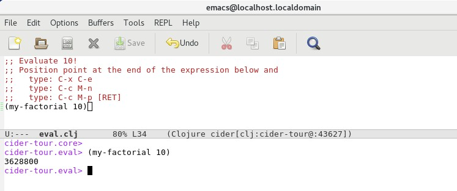

# Code Evaluation

In this section we will explore CIDER's support for evaluation of Clojure code. 

>**FYI**

> A semicolon character is used to indicate the start of comment text in Clojure.
> Any text that appears after a semicolon is ignored.

Open the file `eval.clj` located in the `code/clj/cider-tour/src/cider-tour` directory of the GitHub project:

**Screenshot - eval.clj**

Position the cursor (i.e. "point") at the end of the `(range 1 6)` statement and type `C-x C-e`:

**Output**

CIDER evaluates the `range` statement and displays the result as a temporary overlay within the buffer. The overlay is removed on any subsequent input to Emacs.

The keybinding `C-x C-e` executes the command `cider-eval-last-sexp` which evaluates the expression preceding point. 

Now let's evaluate a more interesting expression. In the next line of code, position point immediately after the end of the `(range 1 (inc 5))` expression and type `C-x C-e`. 

**Output**

Note that only that `range` statement is evaluated because it is the expression that precedes point. 

>**FYI**

>`C-x C-e` is useful when for evaluating nested expressions and inspecting the value of vars.

Now, without moving the cursor, type `C-M-x`:

**Output**

The keybinding `C-M-x` invokes the `cider-eval-defun-at-point` command which parses the expression at point to find the top-level expression and then evaluates the top-level expression. In this cause the top-level expression is the `(reduce ...)` function call.

>**FYI**

> `C-M-x` is useful for evaluating (or re-evaluating) top-level expressions such as var (`def`) and function (`defn`) definitions. As long as the point lies somewhere within the top-level expression, the top-level expression will be evaluated.

Now, position the cursor within the `(defn my-factorial ...)` expression and type `C-M-x` to evaluate the function definition:

The result of the evaluation is the association of the symbol `my-factorial` with a Clojure var that points to the function. CIDER displays the namespace-qualified symbol as the result.

Now let's evaluate the `my-factorial` function. Position point at the end of the `(my-factorial 10)` line and type `C-x C-e`:

**Output**

This evaluates the preceding expression.

Next, type the following:

`C-c M-n`
`C-c M-p [RET]`

`C-c M-n` executes the CIDER function `cider-repl-set-ns` which changes the default namespace of the CIDER REPL buffer to the namespace of the Clojure eval.clj file:

** REPL Output (1/2) **

`C-c M-p` copies the expression preceding point in our eval.clj buffer to the REPL buffer. CIDER switches focus to the REPL buffer. Pressing `[RET]` evaluates the expression:

** REPL Output (2/2) **

>**FYI**

>The use of `C-c M-n` to change the namespace in the REPL was necessary for two reasons:
> 1. The function `my-factorial` is defined in the `cider-tour.eval` namespace and our default namespace in the CIDER REPL buffer was set to `cider-tout.core`.
> 2. The symbol `my-factorial` in the expression `(my-factorial 10)` is not namespace-qualified. The REPL assumes all symbols that are not namespace-qualified reside in the default namespace. Evaluation of the expression with `cider-tour.core` as the default namespace would therefore fail.

