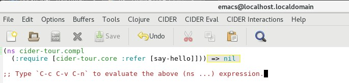
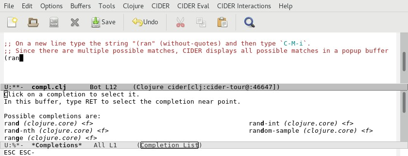

# Basic Code Completion

CIDER provides support for code completion by leveraging the out-of-the-box code completion framework provided by Emacs.

The keybinding `C-M-i` (`complete-symbol`) invokes CIDER's code completion.

In Emacs open the file `compl.clj` located in the `code/clj/cider-tour/src/cider-tour` directory of the GitHub project.

Type `C-c C-v C-n`. This evaluates the `(ns cider-tour.compl ....)` form which imports the `say-hello` function defined in the `core.clj` file.

Now, on a blank line type:

`(say-`

and then type `C-M-i`.

CIDER expands `say-` to `say-hello` because there is only matching symbol.

On a new line, type:

`(ran`

and then type `C-M-i`. Since there are multiple possible matches, CIDER displays all possible matches in a popup buffer:

# Turbo-Charged Completion

In [Spiking Cider](../../Spiking_Cider/README.md) we will add support for the popular [Company Mode](http://company-mode.github.io/) to provide a more interactive and integrated code completion mechanism.

