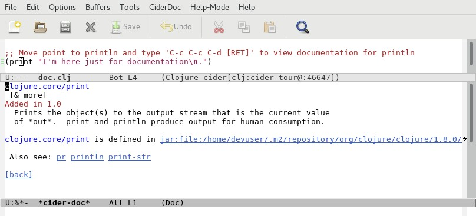
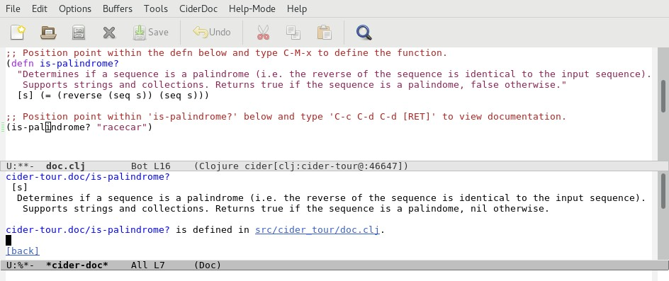

# Documentation

CIDER provides convenient access to local API documentation for application and Clojure functions as well as online documentation for core Clojure functions, third-party Clojure libraries and Java API's.

We will briefly explore the CIDER commands for viewing documentation.

Let's begin by opening the file `doc.clj` located in the `code/clj/cider-tour/src/cider-tour` directory of the GitHub project.

# Local Clojure API Documentation

Position point within (or immediately after) `print` in the expression `(print "I'm here just for documentation\n.")` expression and type `C-c C-d C-d`. In the minibuffer, CIDER prompts for the symbol to lookup documentation and defaults to the symbol at point: `print`. Hit ENTER to accept the default. CIDER displays a popup-buffer with documentation on the core Clojure function `print`:

 

`C-c C-d C-d` executes the `cider-doc` command which performs a lookup for documentation metadata attached to Clojure functions.

Now let's view documentation for an application-level function:

    * Move point to the `(defn is-palindrome? ...)` function definition and type `C-M-x` to evaluate.
    * Next, move point within the `is-palidrome?` string on the `(is-palindrome? "racecar")` line, and type `C-c C-d C-d [RET]`
    
CIDER displays the the documentation for `is-palindrome?`:

 

