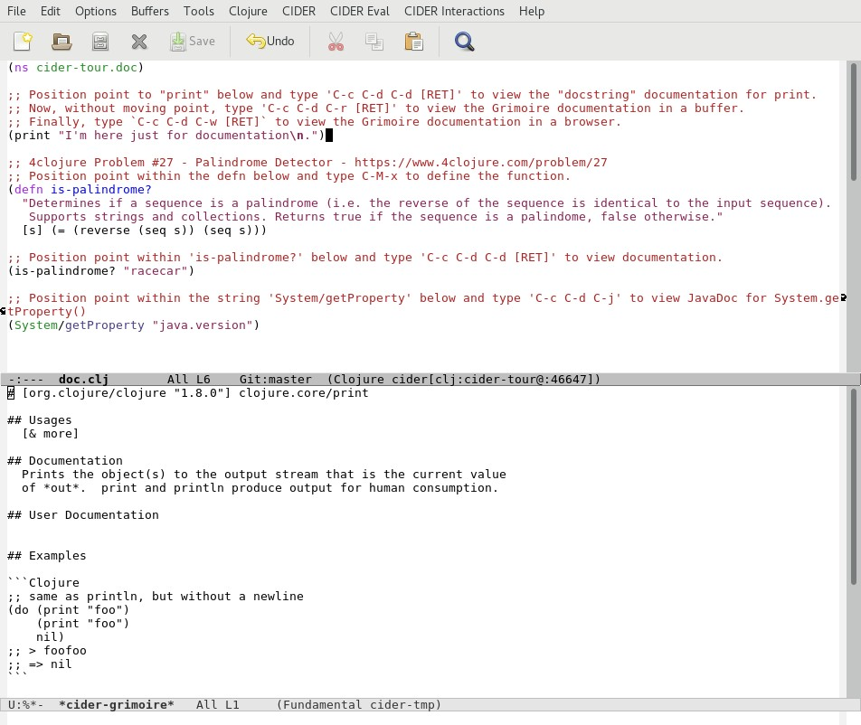
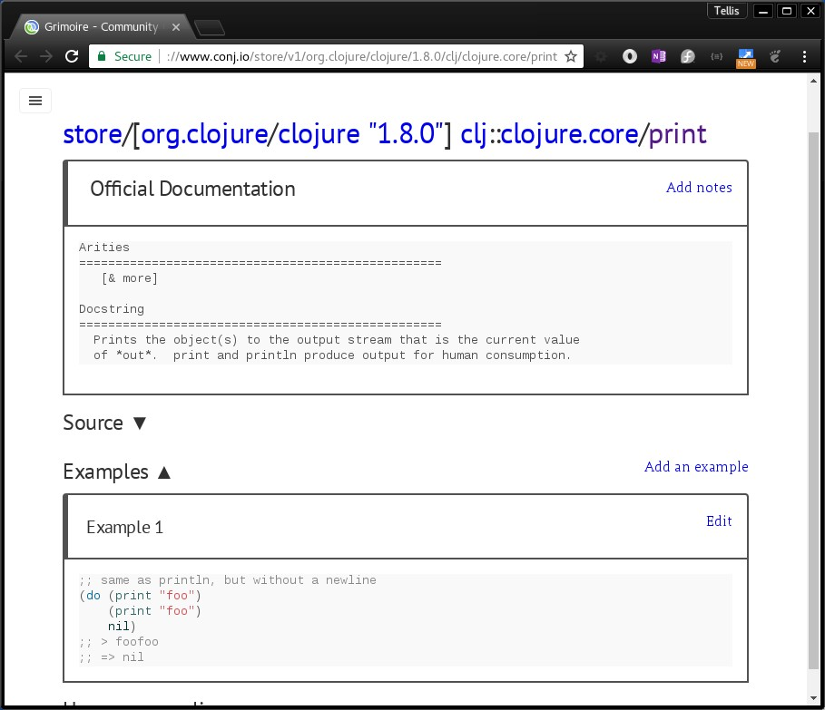
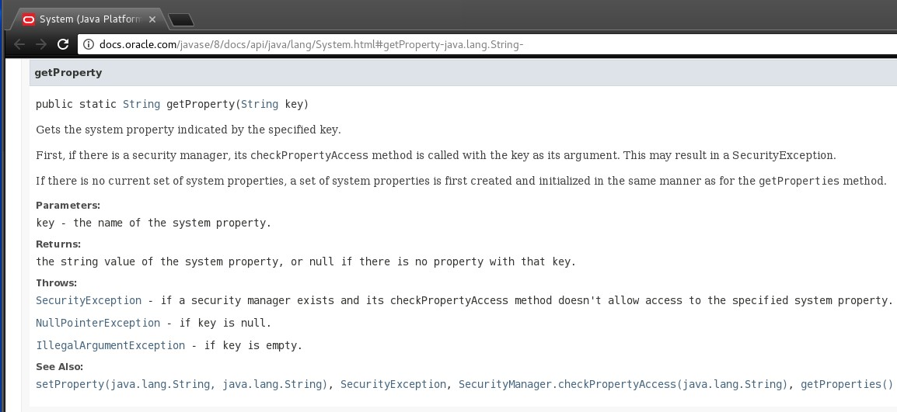

# API Documentation

CIDER provides convenient access to local API documentation for application and Clojure functions as well as online documentation for core Clojure functions, third-party Clojure libraries and Java API's.

We will briefly explore the CIDER commands for viewing documentation.

Let's begin by opening the file `doc.clj` located in the `code/clj/cider-tour/src/cider-tour` directory of the GitHub project.

# Local API Documentation

In `doc.clj` position point within (or immediately after) `print` in the expression `(print "I'm here just for documentation\n.")` expression and type `C-c C-d C-d`. In the minibuffer, CIDER prompts for the symbol to lookup documentation and defaults to the symbol at point: `print`. Hit ENTER to accept the default. CIDER displays a popup-buffer with documentation on the core Clojure function `print`:

 

`C-c C-d C-d` executes the `cider-doc` command which performs a lookup for documentation metadata embedded within Clojure functions and vars (referred to as "docstrings").

CIDER also provides a link to the `print` function's source code which resides in the file clojure-1.8.0.jar. For core Clojure functions, `cider-doc` also provides links to any related functions.

Now let's view documentation for an application-level function:

    * Move point to the `(defn is-palindrome? ...)` function definition and type `C-M-x` to evaluate.
    * Next, move point within the `is-palidrome?` string on the `(is-palindrome? "racecar")` line, and type `C-c C-d C-d [RET]`
    
CIDER displays the the documentation for `is-palindrome?`:

 

>**FYI**

> CIDER provides a major mode (`cider-docview-mode`) for pop-up buffers that display documentation. This is indicated by `(Doc)` on the modeline. `cider-docview-mode` extends the standard Emacs help-mode by providing a 'CiderDoc' menu (and shortcut keys) for navigating documentation and searching symbols.

## Online API Documentation

### Grimoire

CIDER provides integrated access to documentation in [Grimoire](http://www.conj.io)- a community-maintained Clojure documentation repository. Grimoire is essentially a Clojure reference cheat-sheet. Unlike the `cider-doc` documentation, Grimoire's documentation typically includes examples and source code (for functions).

CIDER provides two commands for looking up documentation in Grimoire:

* `C-c C-d C-r` -- View Grimoire documentation in a popup buffer
* `C-c C-d C-w` -- View Grimoire documentation in browser

In `doc.clj` position back on the `print` function call and type `C-c C-d C-r`. CIDER displays the Grimoire documentation for `print` in a popup buffer:

 

Now type `C-c C-d C-w`. CIDER displays the Grimoire documentation for `print` in a browser window:

 

### JavaDoc

Clojure provides Java interop capability via access to Java classes, interfaces and  objects. CIDER provides access to the Oracle Java API documentation (a.k.a "JavaDoc").

In `doc.clj` position point on the string "System/getProperty" and type `C-c C-d C-j [RET]`. This opens a browser window that loads the JavaDoc for the Java System.getProperty() API.

## Documentation Search

CIDER also provides commands for searching symbols. These commands as well the documentation lookup commands that we have explored are accessible from the _Cider Interactions >> Documentation_ menu.

