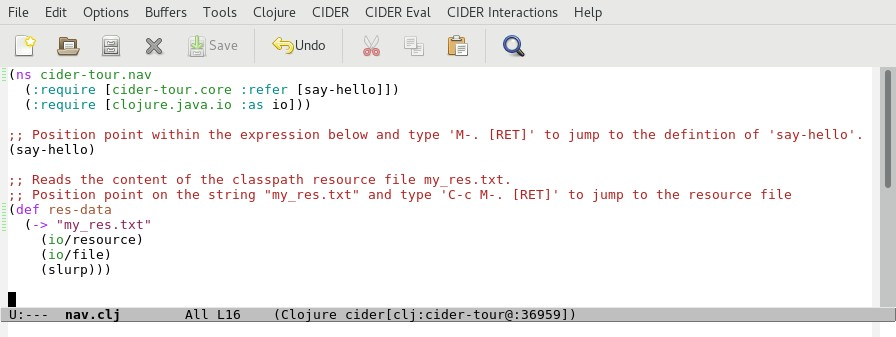

# Code Navigation

## Overview

CIDER provides the following commands for jumping to the definition symbols and resources:

| Keybinding | Command               | Description |
| ---------- | -------               | ----------- |
| `M-.`      | `cider-find-var`      | Jumps to the file where the symbol at point is defined |
| `C-c M-.`  | `cider-find-resource` | Jumps to a resource defined on the classpath |
| `M-,`      | `cider-pop-back`      | Jumps back to the previous buffer|

All of the above commands are available on the _Cider Interactions >> Find (jump to)_ menu.

## Hands-On

In Emacs open the file `nav.clj` located in the `code/clj/cider-tour/src/cider-tour` directory of the GitHub project:

**Screenshot - nav.clj**

Position point within the `(say-hello)` expression and type `M-. [RET]`. CIDER jumps to the `core.clj` file where `say-hello` is defined.

Next, type `M-,`. CIDER jumps back to the `nav.clj` buffer.

Now position point within the string `"my_res.txt"`. This string is the name of a file in the ``code/clj/cider-tour/resource` directory. The `resource` directory is on the classpath. Type `C-c M-.` to load the `my_res.txt` file from the classpath.

