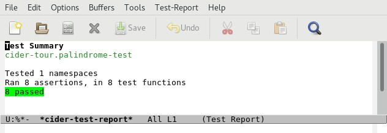

# Running Tests

## Overview

CIDER provides support for running unit tests created using the Clojure [core.test](https://clojure.github.io/clojure/clojure.test-api.html) library. Tests can be executed from buffers containing Clojure application code, unit test code or from the CIDER REPL.

## Hands-On

Open the file `palindrome.clj` located in the `code/clj/cider-tour/src/cider-tour` directory of the GitHub project:

In another buffer or frame open the file `palindrome_test.clj` located in the `code/clj/cider-tour/test/cider-tour` directory of the GitHub project:

`palindrome_test.clj` contains the unit tests for functions defined in the `cider-tour.palindrome` namespace.

Now switch focus back to `palindrome.clj` and run all unit tests for the `cider-tour.palindrome` namespace by typing `C-c C-t C-n`:

CIDER displays a summary of the results in the minibuffer:

For details on test results, CIDER creates a buffer (\*cider-test-report\*) that provides details on the test execution including any errors:

CIDER provides a _Test-Report_ menu (with shortcut keys) to facilitate navigation and running of tests within (\*cider-test-report\*) buffer.

Now let's run a specific test. Switch to the `palindrome_test.clj` buffer, position point within the `(deftest string-palindrome-test-pos ...)` expression and type `C-c C-t C-t`. CIDER displays the results for the unit test in the minibuffer:

Now let's fabricate a unit test failure:

 * Within the `(deftest string-palindrome-test-pos ...)` expression change "racecar" to "racecars".
 * Type `C-c C-k` to update the code in the REPL. 
 * Type `C-c C-t C-n` to re-run the unit tests

