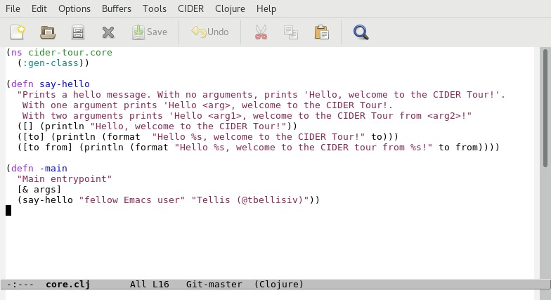
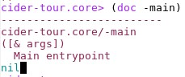

# Running Our Application

Now that we have some familiarity with Clojure concepts and syntax, lets turn our attention back to the cider-tour application.

## A Look at the Source

In Emacs open the `core.clj` file that resides under the `src/cider-tour` directory of the project.

**Screenshot - core.clj**

`core.clj` is generated by Leiningen to provide boilerplate code for the application's entry-point (by convention the `-main` method). It contains the following:

* A `ns` function call to set the namespace to `cider-tour.core` for all functions/vars defined in the file. This is conceptually similar to the `package` statement in Java source files.

* A `defn` function call to define a function named `say-hello`. `say-hello` is a [multi-arity](http://clojure-doc.org/articles/language/functions.html#multi-arity-functions) function whose behavior (the "Hello" text printed) depends on the number of arguments passed to the function.

* A `defn` function call to define a function named `-main` that invokes the `say-hello` function with two arguments.

>FYI

> The `-main` and `say-hello` functions each have an embedded [docstring](https://en.wikipedia.org/wiki/Docstring) that provides inline documentation on the usage of the function. The Clojure [doc](https://clojuredocs.org/clojure.repl/doc) function displays parameter information and the docstring for a function (if defined).

>Entering `(doc -main)` in the REPL returns the following: 

>

