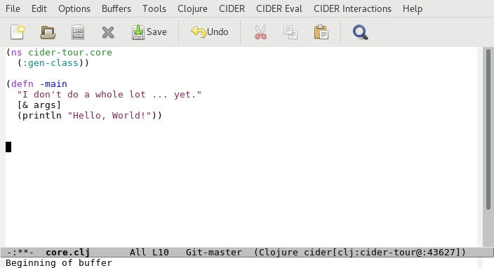
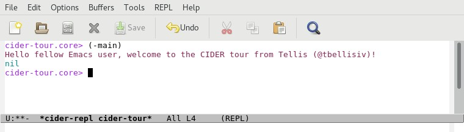

# Running Our Application

Now that we have some familiarity with Clojure concepts and syntax, lets turn our attention back to the cider-tour application.

## A Look at the Source

Keep the CIDER REPL buffer open and, in another buffer, open the `core.clj` file that resides under the `src/cider-tour` directory of the project.

`core.clj` is generated by Leiningen to provide boilerplate code for the application's entry-point (by convention the `-main` method). 

The "out-of-the-box" version of `core.clj` generated by Leiningen looks like this:
**Screenshot - core.clj (original)**

The contents were modified to look like this:

**Screenshot - core.clj (modified)**

`core.clj` contains three function calls:

* A `ns` function call to set the namespace to `cider-tour.core` for all functions/vars defined in the file. This is conceptually similar to the `package` statement in Java source files.

* A `defn` function call to define a function named `say-hello`. `say-hello` is a [multi-arity](http://clojure-doc.org/articles/language/functions.html#multi-arity-functions) function whose behavior (the "Hello" text printed) depends on the number of arguments passed to the function.

* A `defn` function call to define a function named `-main` that invokes the `say-hello` function with two arguments.

>FYI

> The `-main` and `say-hello` functions each have an embedded [docstring](https://en.wikipedia.org/wiki/Docstring) that provides inline documentation on the usage of the function. The Clojure [doc](https://clojuredocs.org/clojure.repl/doc) function displays parameter information and the docstring for a function (if defined).

>Entering `(doc -main)` in the REPL returns the following: 

>

# Running the Code

Switch to your REPL window and type `(-main)` to execute the `-main` function:

**Output**

Executing `(-main)` invokes the `say-hello` with two arguments- "fellow Emacs user" and "Tellis (@tbellisiv)".

>**FYI**

>In the above screenshot the REPL displays the string `nil` in addition to the "Hello" message. `nil` is the return value of the `-main` function. The REPL displays the return value of the function as well as any output sent to STDOUT. In Clojure the return value of a function is the value of the last evaluated expression in the function. 

>The last (only) evaluated expression in our `-main` function was `println` which always returns `nil`. Hence the return value of `-main` was nil (i.e. no value).

## Tab Completion

Now, type `(say-` followed by the tab key (`[TAB]`). CIDER will append the string `hello` to complete the `say-hello` symbol defined in our app. Type `)` and then Enter to execute the `say-hello` function with no arguments:

