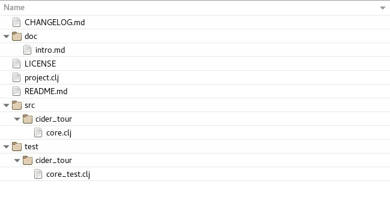

# The "cider-tour" Project

The `code/clj/cider-tour/` directory in the [GitHub](https://github.com/tbellisiv/clojure-emacs-cider-intro) repo contains the Leiningen Clojure project we will use in this chapter.

The base directory structure and files for the cider-tour project were generated by running the `lein` command to generate a Leinigen project from the standard application template:

`lein new app cider-tour`

### The project.clj file

In Emacs open the `project.clj` file for the cider-tour project. This is the Leiningen project file that defines, among other things, the project's dependencies:

**project.clj**  

The cider-tour project has a dependency on Clojure 1.8.0. Like Maven and similar build automation tools, Leiningen auto-downloads project dependencies on first-use.

### Clojure File Extensions

Note that the mode line for the project.clj buffer displays `(Clojure)` indicating that the `clojure-mode` major mode is enabled. CIDER appends entries to the Emacs `auto-mode-alist` variable to enable `clojure-mode` for supported Clojure file types. The major Clojure file extensions are:

| Extension | Content |
| --- | --- |
| .clj | Clojure Code |
| .cljs | ClojureScript Code |
| .edn | [EDN](https://github.com/edn-format/edn) Data |

### Project Directory Structure

Below is a screenshot of the project directory structure and files generated by Leiningen:

| File/Directory | Description |
| --- | --- |
| project.clj| Leiningen project file |
| doc/ | Project documentation root |
| src/ | Source code root |
| src/cider-tour/core.clj | Application entry point- contains "main" function |
| test/| Unit test source root |
| test/cider-tour/core.clj/| Unit test for core.clj |

