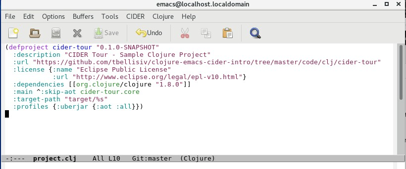

# Open the Sample Project

The ```code/clj/cider-tour/``` directory in the [GitHub](https://github.com/tbellisiv/clojure-emacs-cider-intro) repo contains the Leiningen Clojure project we will use in this chapter.

### The project.clj file

In Emacs open the ```project.clj``` file for the cider-tour project. This is the Leiningen project file that defines, among other things, the project's dependencies:

**project.clj**


The cider-tour project has a dependency on Clojure 1.8.0. Like Maven and similar build automation tools, Leiningen auto-downloads project dependencies on first-use.

### Clojure File Extensions

Note that the mode line displays ```(Clojure)``` indicating that ```clojure-mode``` major mode is enabled. CIDER appends entries to the Emacs ```auto-mode-alist``` to enable clojure-mode for supported Clojure file types. The major Clojure file extensions are:

| Extension | Content |
| --------- | ------- |
| .clj      | Clojure |
| .cljs     | ClojureScript |